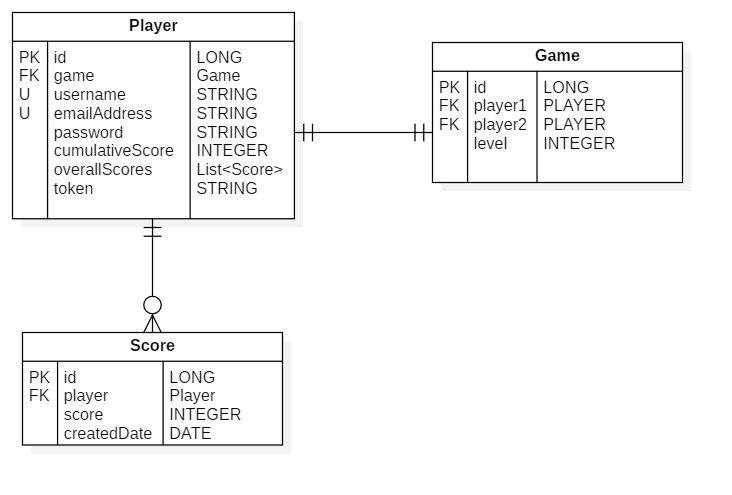

# CENG453 Spring 2021 Term Project 

### Description
This project is a card game called Pişti that can be played both single player against computer and multiplayer against another human. The main aim of the game is to get more points than your opponent by using the cards in your hand to capture the cards on the table. If you play a card with the same rank as the card on the table, you will capture the face-up cards on the table. Some cards can earn you more points. For example, each Jack is 1 extra point or capturing the 10 of Diamonds means 3 extra points. More detailed information about the game rules can be found [here](http://catsatcards.com/Games/Pisti.html).

In each game, there are four levels. The first three levels are against computer (single player). If you pass the first three levels, you will play against a human in the final level. When you complete the game, your overall score will be saved in the database, and it will be displayed in the leaderboard if it is high enough.

Also, after the third level, the game is turning to Bluffing Pisti where the players can make bluff claims in order to get more points. If the opponent player/computer challenges, then there are two situations: If bluff is true, that is, the player's card has the same rank with the face-up card, the player will score 20 points for the Pisti. Otherwise, the opponent will gain the same point. If the opponent does not challenge, the player of the card automatically scores a Pisti. The same algorithm applies for Double Pisti case.

### Contributors
- Batuhan Gökçe
- Nur Gizem Altıntaş

### Database Schema 
- Can be found on [documents/ERDiagram.jpg](./documents/ERDiagram.jpg)

### Rest API Tests
- Can be found on [documents/453.postman_collection.json](./documents/453.postman_collection.json)

### Swagger Documentation
- Can be accessed on http://localhost:8083/server3/swagger-ui.html

### User Manual
- Can be found on [client/UserManual.md](./client/UserManual.md)

### Back-end and Front-End Technologies
- Maven is used as a build tool for the project.
- Spring Boot is used to create the project.
- MariaDB is used as DBMS.
- Spring Security is used for encrypting passwords.
- Lombok is used in order to achieve a higher readibility in the code.
- For unit testing, we have used JUnit5 and Mockito.
- Swagger is used in order to document APIs.
- JavaFX is used for creating a desktop application.

### Database Schema

We have created 3 tables in the database; Player, Game and Score. Player table is responsible for holding players' information such as username, password, token etc. Username and email attributes are unique. Game records are kept on the 'Game' table. 

User have one-to-one relationship with Game. A player may or may not be involved in a game. So, game attribute in a player entity may be null if the player is offline. If the level of a game entity is less than 4 (single player), it should hold a reference to only one player and player2 attribute should be null. If level of the game is four, it should hold references to two different players.

Score table is holding overall scores of the players. When a player completes a game, his/her overall score is kept on this table with creation date.

### Packages
Our package structures for both server and client are explained below:

#### Server
- api : Classes that handle API requests made from the front-end and return a response entity.
- common : All constant fields, messages, or abstract classes.
- config : Configuration-related classes.
- DTO :  Data Transfer Objects providing us communication between front-end and back-end.
- enums : Contains enumerations.
- exception : Involves checked exceptions extending RunTimeException.
- model : All the entities that are corresponded to our data models.
- repository : Repository interfaces for that entities.
- service : Implemented business rules or calls to repository methods. Generally directed from inside a controller method.
- utils : Includes a utility class and its' static methods called from more than one service classes.

#### Client
- component : Representing the game components and most of them extend different types of panes.
- constant : All constant fields related to color or stage, messages, request urls, etc.
- controller : Responsible for communication with the backend by creating a web client (get/post) request.
- DTO : Data Transfer Objects providing us communication between front-end and back-end.
- enums : Contains enumerations.
- scene : Prepares corresponding scenes by using components.
- concurrency : Manages thread and socket for multiplayer game.

### Authentication & Authorization

We have created an endpoint `/api/v1/player/login` for authentication purposes. Client will send username, and password information in the request. If there is a match found in the database with given credentials, a token is generated randomly. Generated token is saved to the player entity in the database. That token is also returned to the client as a response. Client will use that token in his/her following requests. For example, when the player wants to play a card during the game, his/her token must be inserted in the request in order to authorize the player.

When a person wants to create a new account, a request must be sent to the `/api/v1/player/create` with the user information such as username, password etc. Passwords are encrypted before storing them in the database using BCryptEncoder which is provided by Spring Security.

### Computer Move Strategies

We have developed three different strategies for each of the levels that are easy, normal, and hard, respectively.
- For the easy level, the computer does not track the history of open cards on the table. It just picks a card from its hand randomly.

- For the normal level, it inspects the top one in the face-up (open) cards on the table. Then, it tries to play the card with the same rank as that card. If it does not have a matched card and has a card which rank is Jack, it will play it. Otherwise, plays a random card.

- For the hard level, the computer checks how many cards the pile consists of, and according to the card count, it applies different strategies:
    - If the pile has only one card, the computer tries to gain a Pisti or Double Pisti point primarily. So, it inspects the open card on the table. Then, if it is a Jack, it tries to play a Jack in the case of having that. if it is not a Jack, it plays the card with the same rank as the one on the table to score a Pisti. 

    - Besides, when finding more than one matching card that has the same Rank but a different Suit, it chooses the card with the highest point yield. For example, the face-up card is the ten of Clubs, and the computer has the ten of Diamonds and the ten of Spades as its matching card list. Then, it will pick the ten of Diamonds in order to get 3 extra points.

    - If the pile has multiple cards, it tries to find the matching card with the highest point yield if any. If no such card exists, plays Jack if it has. 

    - For all of the cases above, if the actions cannot be taken because no such card is found, the computer plays a random card from its hand.

    - The last case, if the pile has no cards currently, does not pick a card whose rank is JACK. Other than that, it plays a random card from its hand.

### Communication between the Front-end and Back-end (DTOs)

For the requests sent and responses proceeded, we have two DTOs(Data Transfer Object). They are basically providing us communication between front-end and back-end.
- PlayerActionDTO : Responsible for holding action taken by the player.
    - When a player wants to play a card, the client will make a request with this DTO.
    
    - Includes card to be played, token of the player, id of the player and game, the player type (whether player1 or player2 has played), and the state of the table.
    
- TableStateDTO :   Holds the general state of the table.
    - This DTO will be used between the client and server to hold the state of the table. 
    
    - Includes face-up-cards, face-down-cards, the set of cards belonging to players and computer, the number of captured cards and the level scores of players and computer (according to the game level, player2 or computer attributes in the DTO may be empty/null).
    
    - This DTO has been constructed considering the cost of database management.  We have decided to put objects that are non-persistable such as all the cards here while developing the project.

### Multiplayer Implementation
We have used sockets in order to implement multiplayer level. When server application runs, it creates a new thread to waits for clients to connect. On the client side, application creates a socket to connect the server after single player levels. Once the server is connected to the server, the clients send a message that includes player's user name and the scores of previous levels to the server side. Then, server application prepares new game, and sends state of the game table to clients.

When a player plays a card, a message that contains the player's move is sent to the server through socket connection. That action is processed in the server application and state of the table(cards, scores etc.) is updated. Then, updated table state is sent to clients through socket. When each table state object reaches to the client, the components on the screen are updated.

In socket communication, we have used some classes such as 'TableStateForMultiplayer' and 'PlayerActionForMultiplayer'. There are some requirements to serialize/deserialize messages transferred through socket:

- Classes must be in the same package for both client and server applications.
- Classes must implement 'Serializable' interface.
- Classes must have an attribute 'serialVersionUID' with the same value in both client and server.

To meet these requirements, we have created those classes in 'tr.metu.ceng.construction.common' package for both the client and server applications.

### Testing

1. REST API testing:
 We have 12 REST API methods, their Postman tests are created and the responding collection file location is specified in README.md together with the REST API documentation link generated with Swagger.

2. Database testing: 
The necessary CRUD operations for all the Spring Data JPA Repositories related to the Game, Player and Score entities are tested.

3. Logic (Unit) testing: We have tested our program logic by testing 
 
- the models (Game, Player, Score and Card) including tests of newly added and even overridden methods like                        equals() or hashCode()

- the service methods. We have tried to cover all functionalities by considering both success and                          failure cases.

We have also tested some of the critical GUI events and API requests' success and failures.
 
All tests are passed successfully. In total for backend, we have reached 84% method coverage (not covered part comes from the api package mostly). For client-package, we have reached 53% line coverage.

