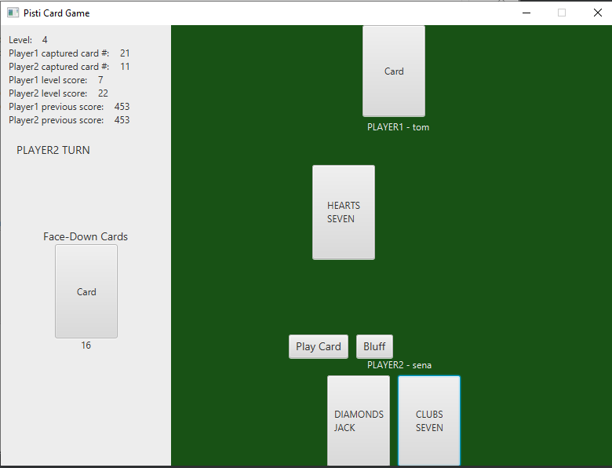

# User Manual

### Main Menu Scene
When the application starts, this page is loaded firstly. There are 4 buttons here; login, register, forgot password and leaderboard buttons. Each button loads another page.

### Register Scene
In this page, people can register by specifying username, password and e-mail address.

### Forgot Password Scene
Users enter their e-mail address, and clicks the button. Then, reset password link will be sent to his/her e-mail address.

### Leaderboard Scene
In this page, there are 3 buttons. Users can list all-times leaderboard, monthly leaderboard or weekly leaderboard by clicking those three buttons.

### Login Scene
Users enter their usernames and passwords in this page. Then, they click the button to login the system. If credentials are correct, another page is loaded automatically. If the credentials are incorrect, a label appears to inform the user.

### Logged-in Scene
When users login the system, this page is loaded. In this page, there are 2 buttons; play and logout. If user clicks play button, s/he starts the game. Also, users can log out by clicking corresponding button.

### Game Scene
We divided this scene into two columns. On the left, general information about the game is displayed such as level, scores, number of captured cards etc.
Also, we divided the right column into three rows. In the top row, opponent cards are displayed. In the middle, face-up cards are displayed. In the bottom, our cards are displayed.

Players should click a card, and then click the play button to play a card. Then, opponent player plays a card. And, game continues like that. 

After starting from 3rd level, another button appears near to the play button for bluffing. When there is only one card at the middle, player can bluff by using that button.

### Multiplayer Scenes
#### Matching Scene
After a player completes all single player levels, a matchmaking scene will appear on the screen.

After a match has been found, the player will see with whom s/he is matched.

Then, a new game will be prepared and a new scene like normal game scene will appear on the screen.

#### Bluffing

Because the multiplayer game is bluffing, when there is one face-up card on the table, player can bluff by selecting the "Bluff" button.

The opponent player can challenge or not challenge the bluffing player. 

According to whether the bluff is true and is challenged by the opponent, the challenging or bluffing player scores and face-up cards are adjusted based on capturing player.

Player will continue to play until one of the player reaches passing score. When a player reaches that score, game ends and winner displayed on the screen.

### Computer Strategies
#### Level 1
Computer plays a card randomly.
#### Level 2
Computer checks its cards. If it has a card that can capture the last card of face-up deck, it plays that card. If there is no capturing card but it has a Jack on his hand, then it plays Jack. Otherwise, it plays a random card.
#### Level 3
One of the differences from the previous level is that if computer has more than one card that can capture the last card, it plays the card with highest extra point.
For example, the face-up card is the ten of Clubs, and the computer has the ten of Diamonds and the ten of Spades as its matching card list. Then, it will pick the ten of Diamonds in order to get 3 extra points.
Another difference is when the computer has a Jack card, and there is no card on the center. In that case, it tries to not throw it except it has only that card.